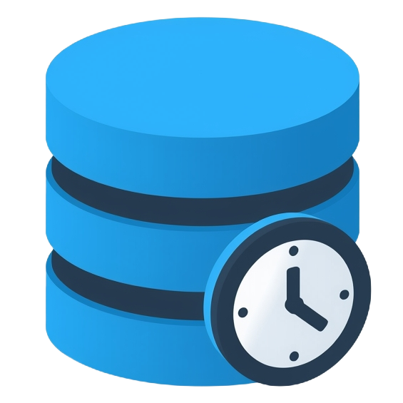

<div align="center">
  <a href="https://apexfluently.beyondthecloud.dev/libraries/cache-manager.html">
    <picture>
      <source media="(prefers-color-scheme: dark)" srcset="./website/public/logo.png">
      
    </picture>
  </a>
  <h1>Cache Manager</h1>

<a href="https://beyondthecloud.dev"></a>


<a href="https://github.com/beyond-the-cloud-dev/soql-lib/blob/main/LICENSE"></a>


</div>

```java
CacheManager.ApexTransaction.put(
    UserInfo.getUserId(),
    [SELECT Id, Name, Country FROM User WHERE Id = :UserInfo.getUserId()]
);

User currentUser = (User) CacheManager.ApexTransaction.get(UserInfo.getUserId());
```

# License notes:
- For proper license management each repository should contain LICENSE file similar to this one.
- each original class should contain copyright mark: © Copyright 2025, Beyond The Cloud Sp. z o.o. (BeyondTheCloud.Dev)
